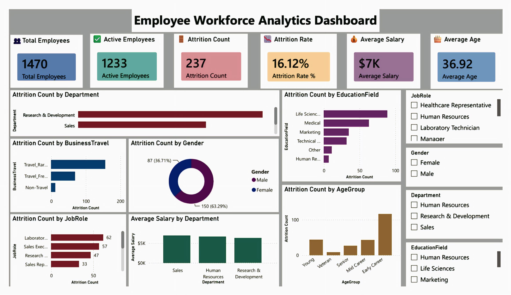

# 👥 Employee Workforce Analytics Dashboard

## 📌 Project Overview

This project presents an interactive Employee Workforce Analytics Dashboard built using Microsoft Power BI. The dashboard analyzes employee demographics, age groups, income bands, departments, and other workforce-related information.

The objective of this project is to transform employee data into meaningful workforce insights using data cleaning, transformation, analysis, and interactive visualization.

## 🛠️ Tools & Technologies

- Microsoft Power BI
- Power Query
- DAX
- Data Cleaning & Transformation
- Data Visualization
- CSV Dataset

## 📂 Dataset

The project uses an employee workforce dataset containing information related to employee demographics, departments, income, age groups, and other workforce attributes.

Dataset file:

`Employee_Workforce_Data.csv`

## 🔧 Data Preparation

The dataset was prepared and transformed using Power Query in Power BI.

Key steps included:

- Data quality and consistency checks
- Checking missing values
- Data type validation
- Data transformation
- Creation of Age Groups
- Creation of Income Bands
- Preparation of data for visualization

## 📊 Dashboard Features

The dashboard provides analysis of:

- Employee Workforce
- Age Groups
- Income Bands
- Departments
- Employee Demographics
- Workforce Distribution
- Interactive filters and visualizations

## 🔍 Key Insights

The dashboard helps identify:

- Workforce distribution across different age groups
- Employee distribution across income bands
- Department-wise workforce patterns
- Demographic characteristics of employees
- Overall workforce composition

## 🖼️ Dashboard Preview

## 🎯 Skills Demonstrated

- Data Cleaning
- Data Transformation
- Data Analysis
- Power Query
- DAX
- Data Visualization
- Dashboard Development
- Workforce Analytics
- Business Insight Generation

## 📁 Project Files

| File | Description |
|------|-------------|
| `Employee_Workforce_Data.csv` | Employee workforce dataset |
| `Dashboard_Screenshot.jpg` | Dashboard preview |
| `README.md` | Project documentation |

## 👨‍💻 Author

**Aditya Kumar**

Electronics & Communication Engineering Student
